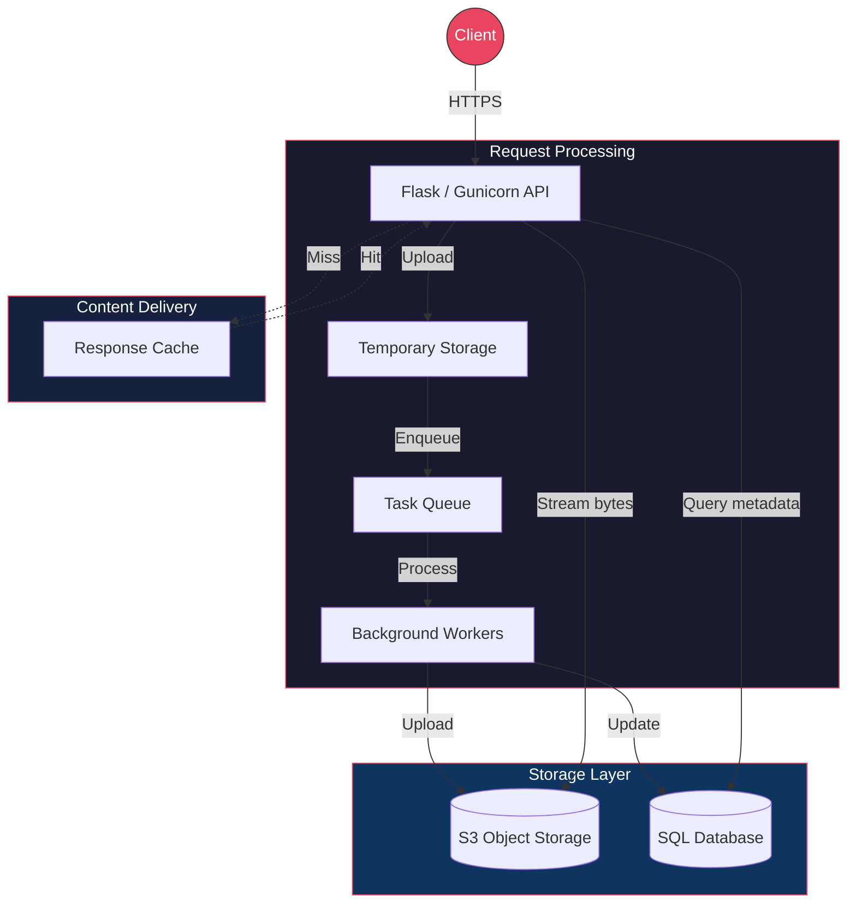
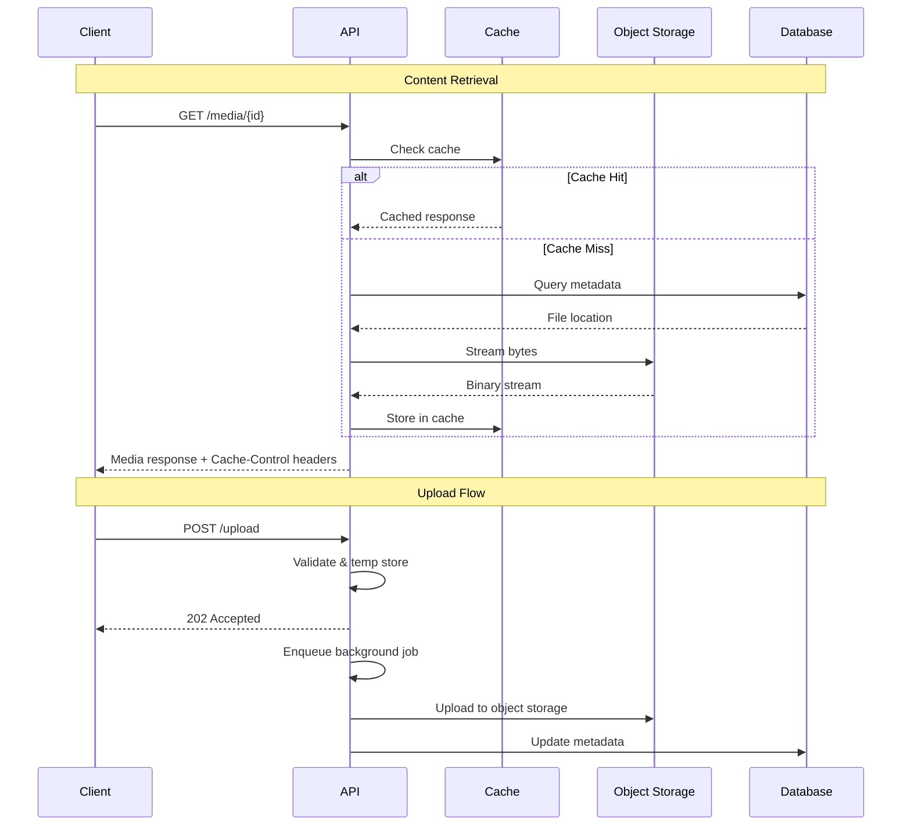

# RedCup Media Engine

High-performance content delivery API with tiered caching and S3-compatible object storage. Separates application logic from storage infrastructure to enable independent scaling.

Built for platforms that serve media-heavy content and need to minimize database pressure while maintaining control over their storage layer.

---

## Features

- **Tiered caching** — browser, CDN, and application-level caching reduces DB queries by ~95%
- **S3-compatible storage** — works with any S3-compatible object store (MinIO, AWS S3, etc.)
- **Background processing** — uploads are queued and processed asynchronously
- **Byte streaming** — media served directly from storage without intermediate disk writes
- **Auto-healing storage** — automatic bucket initialization and health checks on startup
- **Long-lived cache headers** — `Cache-Control: public, max-age=31536000` for immutable assets

---

## Architecture



### Request Flow



---

## Performance

| Optimization | Detail |
|-------------|--------|
| Concurrency | Gunicorn with 4 workers, 2 threads each |
| Caching | Redis-backed response cache |
| Streaming | Direct byte streaming from object storage |
| Headers | Immutable asset caching (1 year TTL) |
| Network | Internal service mesh (no public storage ports) |

---

## Setup

### Prerequisites
- Python 3.10+
- Docker & Docker Compose
- S3-compatible object storage (MinIO recommended for self-hosting)

### Quick Start

```bash
git clone https://github.com/lenn84/redcup-media-engine.git
cd redcup-media-engine

# Copy environment template
cp .env.example .env

# Start all services
docker compose up -d
```

### Environment Variables

| Variable | Description | Example |
|----------|-------------|---------|
| `S3_ENDPOINT` | Object storage endpoint | `http://storage:9000` |
| `S3_ACCESS_KEY` | Storage access key | `your-access-key` |
| `S3_SECRET_KEY` | Storage secret key | `your-secret-key` |
| `S3_BUCKET` | Default media bucket | `media` |
| `REDIS_URL` | Cache connection string | `redis://cache:6379/0` |
| `DATABASE_URL` | SQL database connection | `postgresql://user:pass@db/media` |
| `GUNICORN_WORKERS` | Number of worker processes | `4` |

---

## Usage

### Upload Media

```bash
curl -X POST https://your-domain/upload \
  -H "Authorization: Bearer <token>" \
  -F "file=@image.jpg"

# Response: 202 Accepted
# { "id": "abc123", "status": "processing" }
```

### Retrieve Media

```bash
curl https://your-domain/media/abc123

# Response: binary stream with headers
# Cache-Control: public, max-age=31536000
# Content-Type: image/jpeg
```

### Check Processing Status

```bash
curl https://your-domain/media/abc123/status

# { "id": "abc123", "status": "ready", "size": 245000 }
```

---

## Limitations

- No built-in transcoding (handles storage and delivery, not format conversion)
- Single-region storage (no geo-replication out of the box)
- Queue depth not auto-scaled — monitor worker backlog in production

---

## License

MIT
